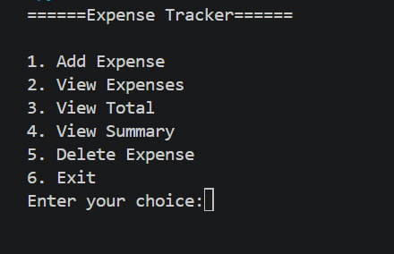
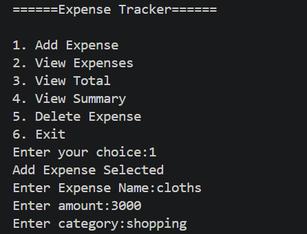
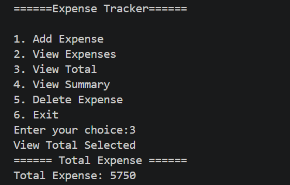
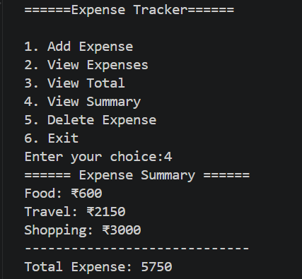
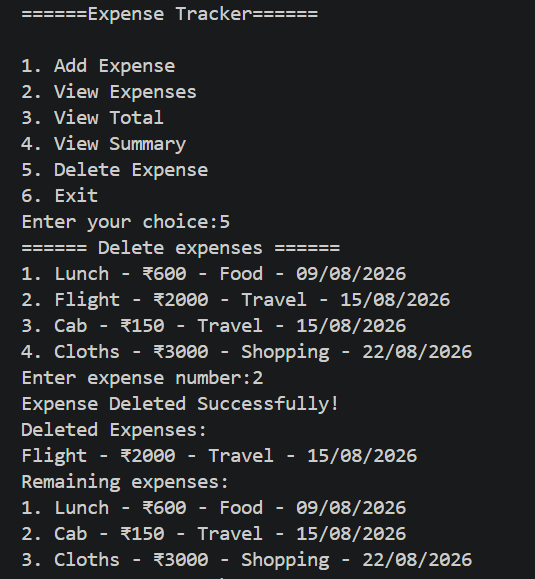

# Expense Tracker

A simple command-line Expense Tracker built using Python.

## Features

- Add expenses with name, amount, category, and date
- View all expenses
- Calculate total expenses
- View category-wise expense summary
- Delete expenses
- Store expenses in a CSV file
- Load saved expenses when the program starts
- Validate user input
- Standardize category names

## Technologies Used

- Python 3
- CSV File Handling
- Git
- GitHub

## How to Run

1. Clone the repository

```bash
git clone https://github.com/swaranagpure-dev/expense-tracker-python.git
```

2. Go to the project folder

```bash
cd expense-tracker-python
```

3. Run the program

```bash
python expense_tracker.py
```
## Data Storage
Expense data is stored locally in a CSV file named `expenses.csv`. Each expense record contains:
- Name
- Amount
- Category
- Date

The saved expenses are automatically loaded when the program starts.

## Input Validation

The program validates user input to handle invalid entries safely.

- Amount must be a positive number
- Menu choice must be between 1 and 6
- Expense number must be valid when deleting an expense
- Invalid inputs are handled using `try-except` without crashing the program

## Screenshots

### Main Menu


### 1. Add Expense


### 2. View Expenses


### 3. View Total


### 4. View Summary


### 5. Delete Expense


### 6. Exit

## Author

**Swaranagpure**